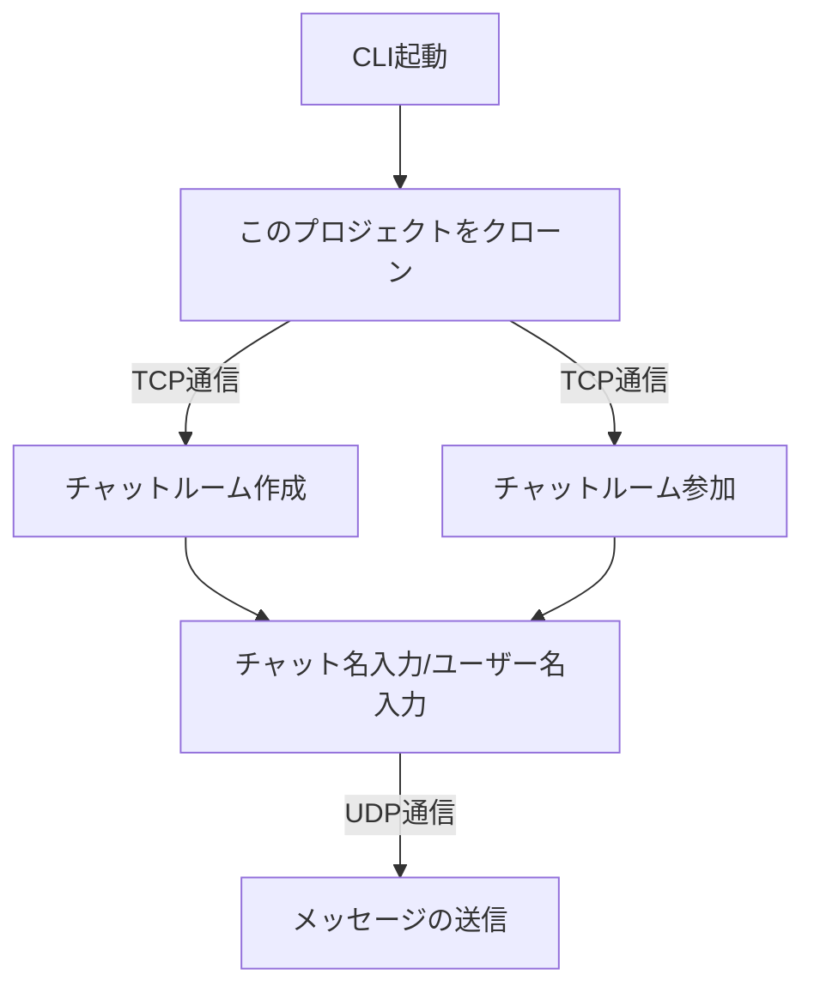
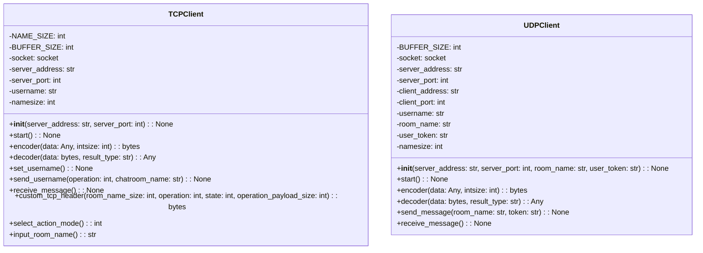

# Online Chat Messenger

## 概要
チャットができるアプリケーション

## 説明
このアプリケーションは、グループチャットができるアプリケーションです。

グループチャットができるアプリケーションと言えば、日本ではLINEやKakaoTalkなどが有名ですね。

このアプリケーションでは、例に挙げたアプリケーションのメイン機能であるリアルタイムでのグループチャットを楽しむことができます!

アプリケーションは簡単に起動でき、友達を招待してすぐにグループチャットを始めることができます。

アプリケーションの実行には、ターミナルという黒い画面にコマンドを入力します。

基本的な機能として、チャットルームの作成/参加/ユーザー同士でのグループチャットができます。

## 前提条件
このアプリケーションを実行するには、下記ソフトウェアを事前にインストールしておく必要があります。

### Git
Gitがインストールされていない場合は、下記手順でインストールしてください。

1. ターミナルを起動する。<br>使用するOSによりターミナルの名称が異なりますので注意してください。<br>(例. Windows:コマンドプロンプト,mac:ターミナル)

2. Gitがインストールされているか確認する。<br>`git version 2.34.1` のように表示された場合は、Gitがインストールされています。<br>以降の手順はスキップしてください。<br>**また、ターミナルは引き続き使用しますので開いたままにしてください!**
```
git --version
```

3. システムを更新する
```
sudo apt-get update
```

4. Gitをインストールする
```
sudo apt install git
```

5. Gitがインストールされたことを確認する。<br>`git version 2.34.1` のように表示されていれば、Gitのインストールは完了です!
```
git --version
```

### Python 3.x
[Python](https://www.python.org/downloads/)の公式サイトからあなたのPCのOSに合わせて、ダウンロードしてください。

ダウンロードしたファイルを使用してインストールできます。

Pythonがインストールされているかは、下記コマンドで確認することができます。

`Python 3.10.12`のように表示されていれば、Pythonはインストールされています。

```
python3 --version
```

## インストール
### クローン
このアプリケーションをあなたのPCで実行するために、クローンします。

クローンとは、このアプリケーションの実行に必要なファイル(リポジトリのコンテンツ)をあなたのPCのローカル環境へコピーすることです。

下記手順でクローンしてください。

1. リポジトリをクローンする
```
git clone https://github.com/teamdev-A-backend/online-chat-messenger.git
```

2. クローンしたリポジトリへ移動する
```
cd online-chat-messenger
```


## 🚀使用方法
1. ターミナルを3つ起動します。<br>起動した3つのターミナルについては、以降の手順では下記名称で呼ぶこととします。

| ターミナル | 名称 |
| ------- | ------- |
| ターミナル1 | サーバ用ターミナル |
| ターミナル2 | クライアント用ターミナル1 |
| ターミナル3 | クライアント用ターミナル2 |

2. サーバ用ターミナルに下記コマンドを入力する
```
python3 server.py
```
3. クライアント用ターミナル1に下記コマンドを入力する
```
python3 client.py
```
4. クライアント用ターミナルに表示される指示に従い、チャットルームを作成する
5. クライアント用ターミナル2に下記コマンドを入力する
```
python3 client.py
```
6. クライアント用ターミナルに表示される指示に従い、手順4.で作成したチャットルームに参加する
7. ユーザー同士でグループチャットを楽しむ
8. グループチャットを終了したい場合は、クライアント用ターミナル1に`exit`と入力して終了する

## 使用例
一通りの手順のイメージは[デモ](#デモ)を参考にしてください。

1. ターミナルを3つ起動します。<br>起動した3つのターミナルについては、以降の手順では下記名称で呼ぶこととします。

| ターミナル | 名称 |
| ------- | ------- |
| ターミナル1 | サーバ用ターミナル |
| ターミナル2 | クライアント用ターミナル1 |
| ターミナル3 | クライアント用ターミナル2 |

2. サーバ用ターミナルに下記コマンドを入力する
```
python3 server.py
```
3. クライアント用ターミナル1に下記コマンドを入力する
```
python3 client.py
```
4. ユーザーがチャットルームを作成する。
```
python3 client.py
```
5. 別のユーザーががチャットルームに参加する
6. ユーザー同士でグループチャットを楽しむ。

### ユーザー入力について
| 用語 | 意味 |
| ------- | ------- |
| Input user name(Up to 10 characters) : | ユーザー名を入力して下さい。<br>文字数は、最大10文字までです。<br>入力例. user1 |
| Input operation(choose 1 or 2) : | チャットルームを作成するか参加するか選択してください。<br>・1 : チャットルームを作成する<br>・2 : チャットルームに参加する<br>入力例. 1 |
| Input room name(Up to 8 characters) : room1 | チャットルーム名を入力してください。<br>文字数は、最大8文字までです。<br>入力例. room1 |
| Password conditions.<br>Must be between 6 and 11 characters and include the following characters.<br>・Uppercase letters<br>・Lowercase letters<br>・NumbersInput<br>Input password :| パスワードを設定してください。<br>6~11文字で下記の文字を含めてください。<br>・アルファベットの大文字<br>・アルファベットの小文字<br>・数字<br>入力例. Abc123 |
| Input room name size (Range 0 to 255): | チャットルームの最大人数を入力してください。<br>人数は、0~255人です。<br>入力例. 2 |
| Input host token :  | ホストトークンを入力してください。<br>この指示は、`Input operation(choose 1 or 2) :`で2を入力した後に、表示されます。<br>チャットルームが作成された時に、トークンが表示されているはずなのでコピーして貼り付けてください。<br>入力例. 858e85fc-6143-4086-99d2-4205135ae259 |

## 使用技術
<table>
<tr>
  <th>カテゴリ</th>
  <th>技術スタック</th>
</tr>
<tr>
  <td>開発言語</td>
  <td>Python</td>
</tr>
<tr>
  <td rowspan=2>インフラ</td>
  <td>Ubuntu</td>
</tr>
<tr>
  <td>VirtualBox</td>
</tr>
<tr>
  <td rowspan=2>その他</td>
  <td>Git</td>
</tr>
<tr>
  <td>Github</td>
</tr>
</table>


## プログラムの流れ

1. クライアントでチャット作成(1)/参加(2)の選択
2. クライアントのCLIに従ってユーザーが入力
3. サーバ側が受け取った情報を元にユーザー・チャットルームを作成/参加
4. サーバが受け取ったデータをクライアントに送信
5. チャットスタート



## プロジェクトの創意工夫点
1. このプロジェクトではUDP/TCP通信で処理を進めていることからクラスを
   - server.pyをudp_serverとtcp_server
   - client.pyをudp_clientとtcp_client
   
   に分けるようにしてTCP→UDPの処理をスムーズに開発できるようにしました。
   
2. chat_roomクラスを別で作ってユーザーを各クラス間で伝達しやすくしました。
## クラス図

### 1. server

### client



## TCP通信について
-  TCP（Transmission Control Protocol）は、インターネットプロトコルスイートの一部であり、ネットワークを介してデータを送受信するためのプロトコルの一つです。TCPは、データの送受信を確実に行うための信頼性の高い接続を提供します。今回のchat room作成/接続は送受信の確実性の観点から採用しました。


- ヘッダー（32バイト）：RoomNameSize（1バイト） | Operation（1バイト） | State（1バイト） | OperationPayloadSize（29バイト）
- ボディ：最初のRoomNameSizeバイトがルーム名で、その後にOperationPayloadSizeバイトが続きます。ルーム名の最大バイト数は2^8バイトであり、OperationPayloadSizeの最大バイト数は2^29バイトです。


## UDP通信について
- UDP（User Datagram Protocol）は、インターネットプロトコルスイートの一部であり、ネットワークを介してデータを送受信するためのプロトコルの一つです。UDPは、データの送受信を高速に行うためのシンプルな接続を提供します。


- Client側でメッセージのサイズを検証。4096を超えたら再入力を促す。
- ヘッダー：RoomNameSize（1バイト）| TokenSize（1バイト）
- ボディ：最初のRoomNameSizeバイトはルーム名、次のTokenSizeバイトはトークン文字列、そしてその残りが実際のメッセージです。


