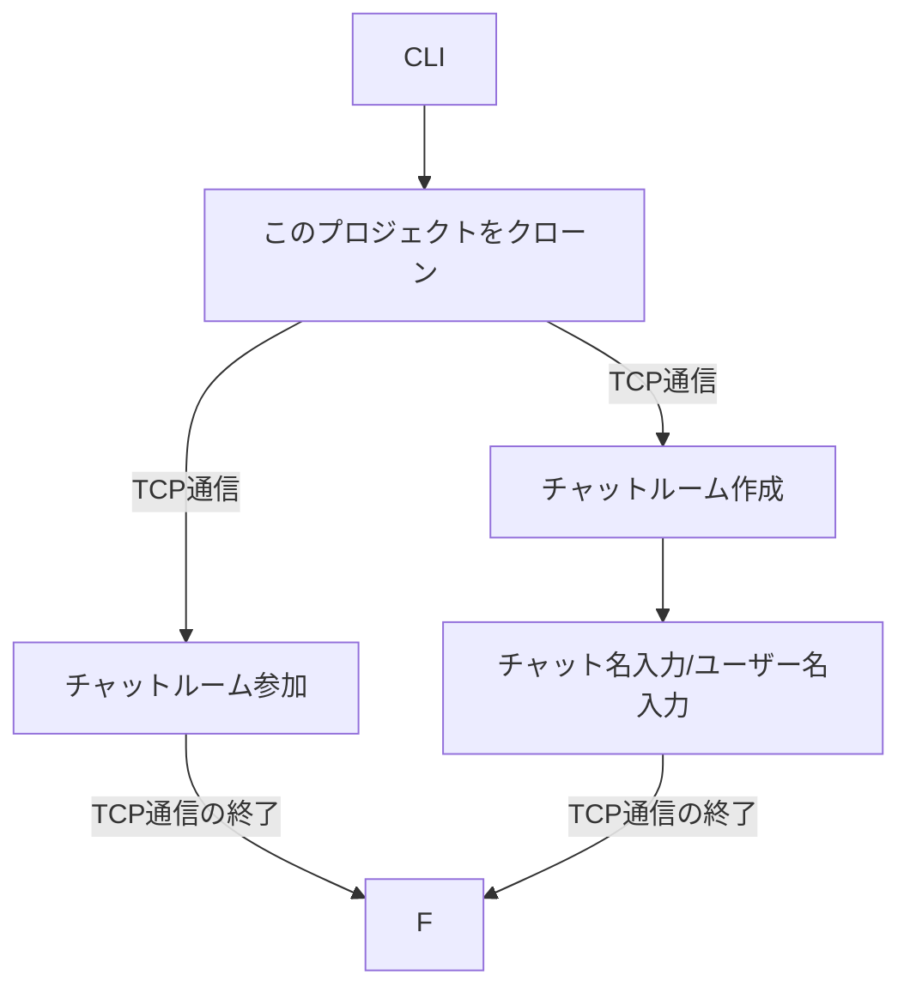

# Online Chat Messenger

## 概要
このプロジェクトは,クライアントとサーバ間でTCP通信のチャットルームの作成/参加とUDP通信のメッセージの送受信をするプロジェクトです。CLIで操作をします。

### プログラムの流れ

1. チャット作成(1)/参加(2)の選択
2. CLIに従ってユーザーが入力
3. サーバ側が受け取った情報を元にユーザー・チャットルームを作成/参加
4. サーバが受け取ったデータをクライアントに送信
5. チャットスタート

## インストール

以下の手順に従って、プロジェクトをセットアップしてください。

1. リポジトリをクローンします。
2. 必要な依存関係をインストールします。
3. データベースをセットアップします。

## 使用方法
