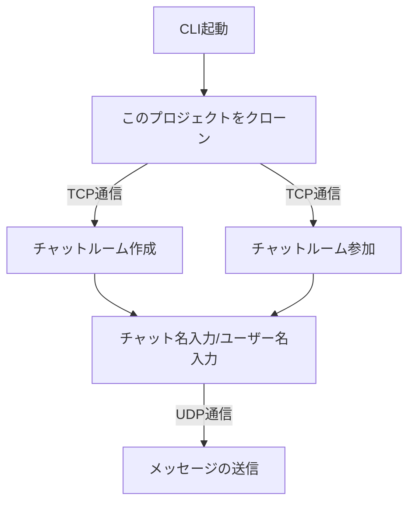
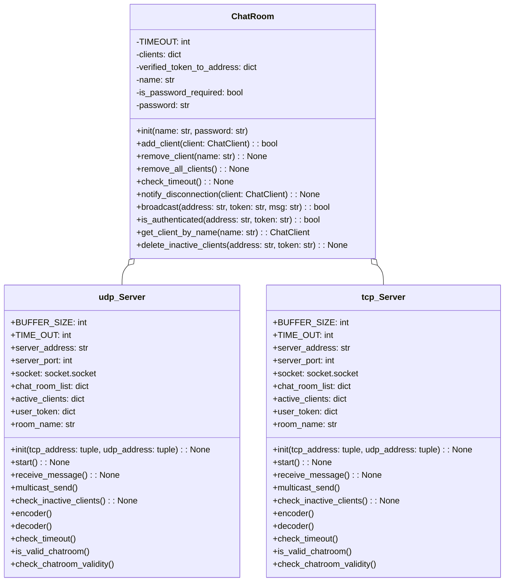

# Online Chat Messenger

## 概要
このプロジェクトは、クライアントとサーバ間でTCP通信のチャットルームの作成/参加とUDP通信のメッセージの送受信をするプロジェクトです。CLIで操作をします。
また、3人のチーム開発でこのプロジェクトは完成させました。

### プログラムの流れ

1. クライアントでチャット作成(1)/参加(2)の選択
2. クライアントのCLIに従ってユーザーが入力
3. サーバ側が受け取った情報を元にユーザー・チャットルームを作成/参加
4. サーバが受け取ったデータをクライアントに送信
5. チャットスタート

## プロジェクトの創意工夫点
1. このプロジェクトではUDP/TCP通信で処理を進めていることからクラスを
   - server.pyをudp_serverとtcp_server
   - client.pyをudp_clientとtcp_client
   に分けるようにしてTCP→UDPの処理をスムーズに開発できるようにしました。
2. 
## クラス図

### 1. server

## プログラムのデモ

## TCP通信について

## UDP通信について

